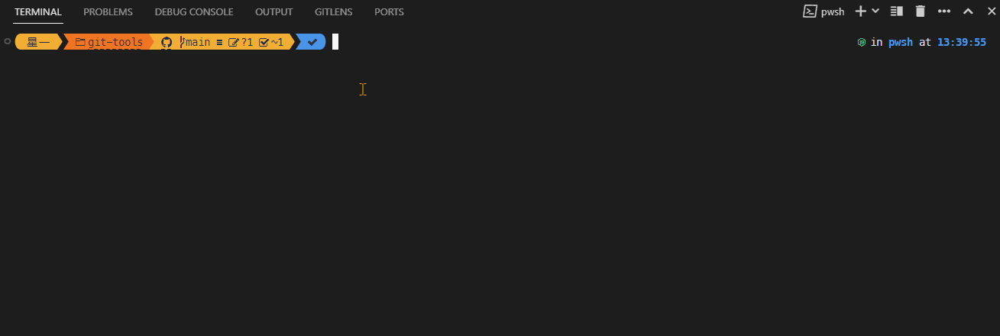

# git-tools

**@star-one/git-tools**



# 安装

- 全局安装

  ```bash
  # 使用npm安装
  npm install -g @star-one/git-tools
  ```

  安装后会在全局注册 `sogt` 命令

如果不想全局安装，也可以选择在项目中安装

- 项目安装

  ```bash
  # 使用npm安装
  npm install -D @star-one/git-tools
  # 使用npx，来执行命令
  npx sogt commit
  ```

# 基本使用

- 终端进入需要及提交的目录
- 手动暂存需要提交的文件
- 输入命令 `sogt commit`或者简写命令`sogt c`
- 进入交互流程，选择 type，输入 scope、detail
- 确认 git 提交信息，即可
